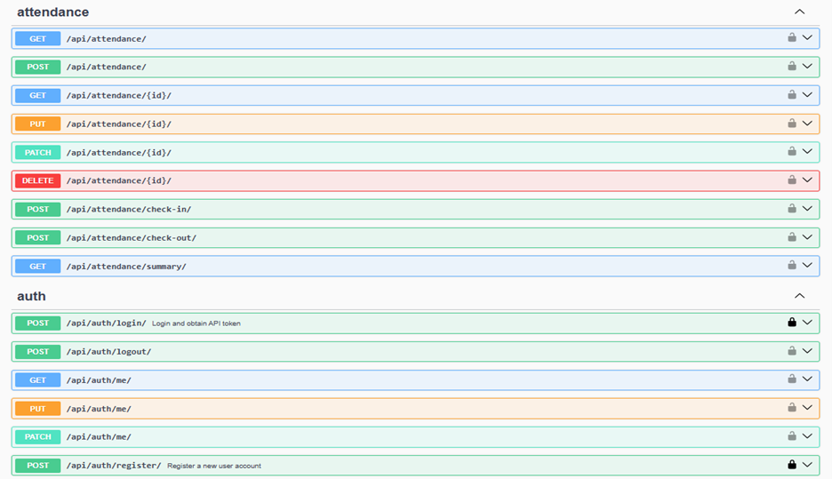
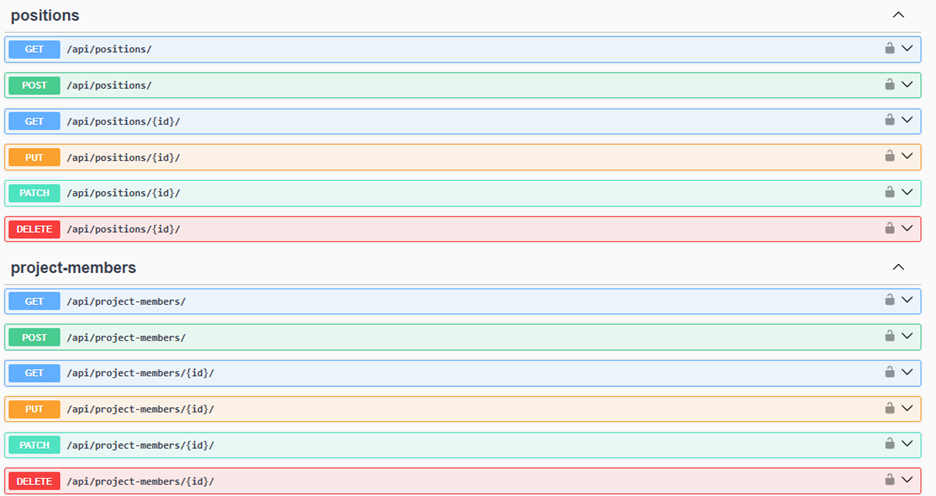

# Mini ERP Backend System

A modular **Enterprise Resource Planning (ERP)** backend built with
**Django** and **Django REST Framework**.\
It provides REST APIs for **HR**, **Leave Management**, **Attendance**,
and **Project Management** modules.

This project demonstrates **production‑grade Django architecture**, REST
API design, token authentication, Swagger documentation, and automated
testing.

---
# Technologies Used

- Python 3.11+
- Django 4.2
- Django REST Framework 3.15
- drf-spectacular (OpenAPI / Swagger documentation)
- django-filter -- filtering support
- Pillow -- image handling
- python-decouple -- environment variables
- SQLite (development)
- PostgreSQL (production ready)
- DRF Token Authentication
- Django TestCase / pytest

---

# Setup Instructions

## 1. Clone Repository

    git clone https://github.com/tajudintemam/mini-erp-backend.git
    cd mini-erp-backend

## 2. Create Virtual Environment

    python -m venv venv

Activate:

Linux/Mac:

    source venv/bin/activate

Windows:

    venv\Scripts\activate

## 3. Install Dependencies

    pip install -r requirements.txt

## 4. Environment Variables

Create `.env` file:

    SECRET_KEY=your-secret-key
    DEBUG=True
    ALLOWED_HOSTS=*

---

## 5. Apply Migrations

    python manage.py migrate

## 6. Create Superuser

    python manage.py createsuperuser

## 7. Run Server

    python manage.py runserver

API: http://127.0.0.1:8000/api/\
Admin: http://127.0.0.1:8000/admin/

---

# Authentication

Use Token Authentication:

Header example:

    Authorization: Token <your-token>

Endpoints:

- POST /api/auth/register/
- POST /api/auth/login/
- POST /api/auth/logout/
- GET /api/auth/me/

---

# Modules

## HR

Departments, Positions, Employees

## Leave Management

Leave types, leave requests, approval workflow

## Attendance

Check-in / Check-out tracking and monthly summaries

## Project Management

Projects, tasks, members, comments

---

# Swagger API Documentation

The project includes interactive API documentation using **Swagger UI**.

Access it at: http://127.0.0.1:8000/api/docs/

## Swagger Screenshot

## 

## 

# Running Tests

    python manage.py test tests

---

# Environment Variables

Variable Description

---

SECRET_KEY Django secret key
DEBUG Enable debug mode
ALLOWED_HOSTS Allowed hosts list

---

# Author

Tajudin\
your.tajudin@gmail.com.com\
GitHub: https://github.com/tajudintemam

---

# License

This project is for **educational purposes** as part of a Django REST
Framework training project.
